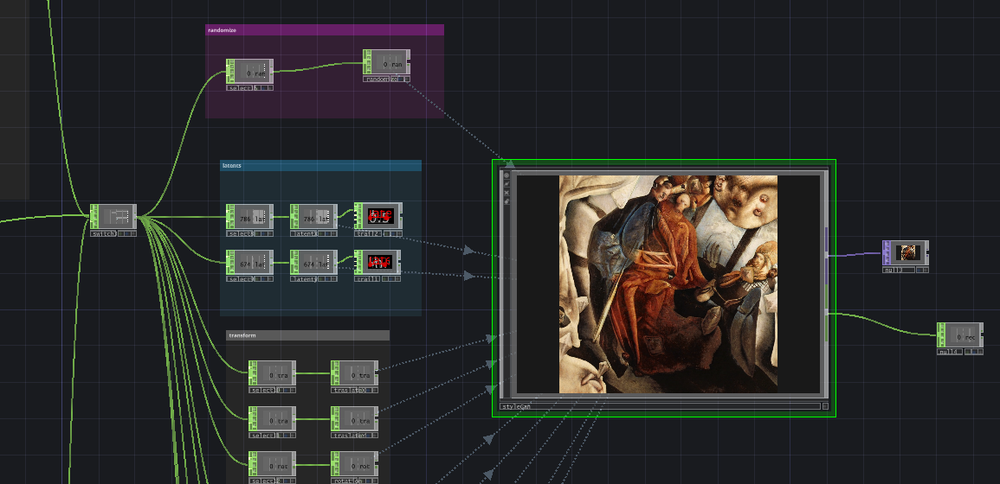

# Reactive StyleGAN NDI



## osc port in: 161

| osc path | description | type |
| ------------- | ------------- | ------------- |
| /setpkl | set pkl path to be loaded | string |
| /latentX | pushes the latent in x direction | float |
| /latentY | pushes the latent in y direction | float |
| /truncpsi | psi truncate | float |
| /trunccutoff | psi trunc cutoff | int |
| /inputtransformx | input transform x-axis | float |
| /inputtransformy| input transform y-axis | float |
| /inputtransformrotation| input transform rotation | float |
| /imagescaledb | image scale db | float |
| /get_favorite_data | gets momentary latent information | float |
| /set_latent_offset | sets latent offsetto match a favorite | float |
| /fps | sets desired render frequency | int |
| /randomize | randomizes the seed | any |


## osc port out: 162

Receive favorite data

| osc path | description | type |
| ------------- | ------------- | ------------- |
| /favorite_data | favorite data of momentary latents | string |

example favorite

```json
{"latentX":161.161, "latentY":13.12}
```

## osc port out: 163

Receive model loading info

| osc path | description | type |
| ------------- | ------------- | ------------- |
| /model_loading | 1 if loading, -1 if done loading pkl model | int |

